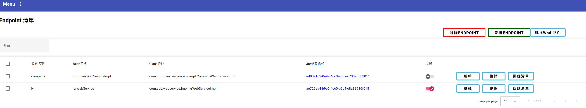
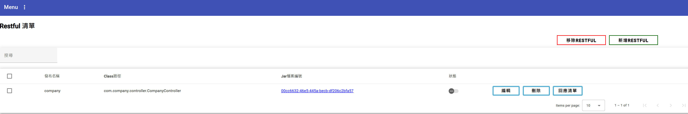
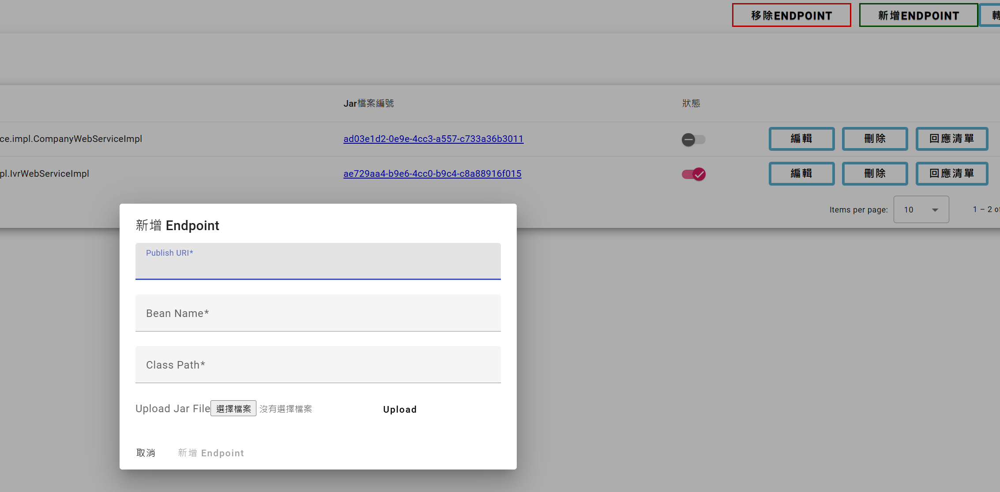
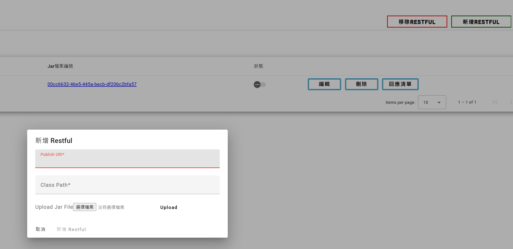

# dynamic-api
======================
可製作虛擬的 wsdl 或 rest jar 動態加載至服務，並根據 request 條件回應內容
1. 專案列表:
- backend: 動態加載後端服務
- base-jar: 提供自製 wsdl 或 rest jar 所需的功能
- frontend: 前端頁面服務
- endpoints: wsdl endpoint jar 
- restfuls: restful api jar
- postman: wsdl 和 rest 測試範例

## 開發環境
* OpenJDK 17
* Spring boot 3+
* Node.js 17+
* Angular 17+
* gradle 8.0.0+

## 使用方式
1. 切換至 mockwebservice-backend 目錄,執行 gradle bootJar
2. mockwebservice-backend 打包完成後會一併將 mockwebservice-frontend 打包至 backend 的 resources 目錄
3. 切換至 mockwebservice-backend/build/libs 目錄,執行 java -jar mockwebservice-backend-0.0.1-SNAPSHOT.jar

運行畫面:(http://localhost:8080/dynamic-api/#/endpoint)

## 備註
* 如有有興趣想討論，或有任何想法想加入開發，可跟我聯絡，信箱:zipe.daden@gmail.com
