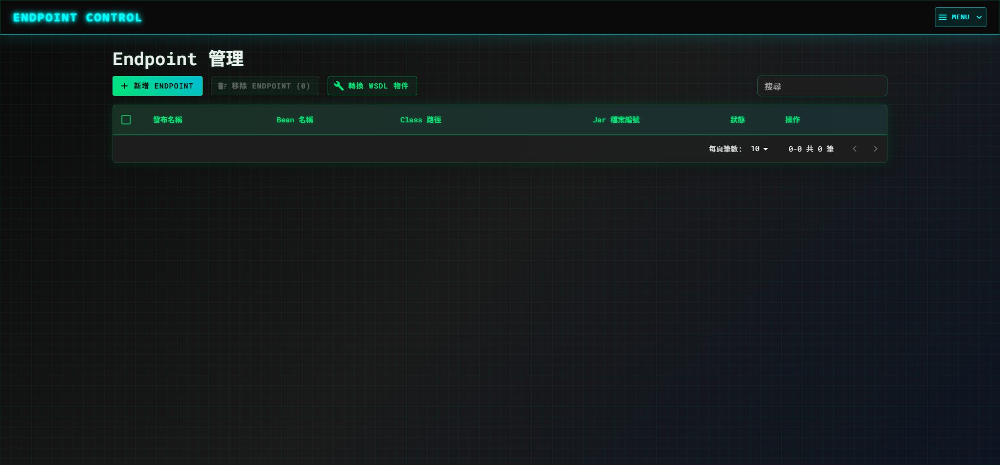
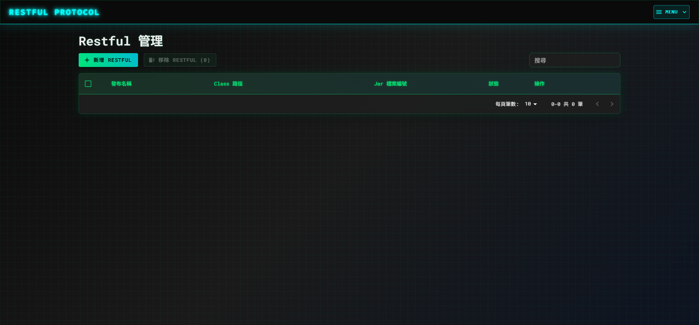
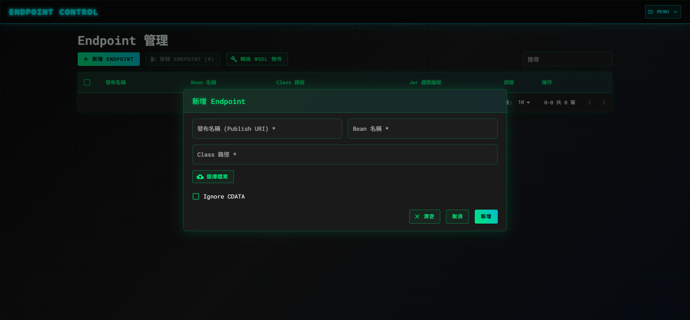
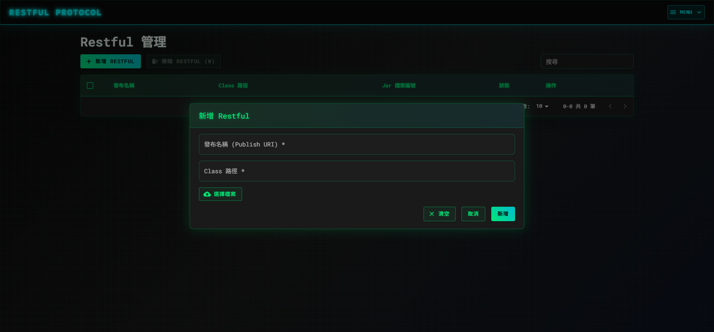

[](https://confluence.jetbrains.com/display/ALL/JetBrains+on+GitHub)

# Dynamic API Manager

可製作虛擬的 WSDL 或 REST JAR 動態加載至服務，並根據 request 條件回應內容。

## 📋 專案列表

- **backend**: 動態加載後端服務（Spring Boot）
- **nextjs-dynamic-api-manager**: 前端管理界面（Next.js）
- **base-jar**: 提供自製 WSDL 或 REST JAR 所需的功能
- **endpoints**: WSDL endpoint JAR 範例
- **restfuls**: RESTful API JAR 範例
- **postman**: WSDL 和 REST 測試範例

---

## 🛠️ 開發環境

- **Java**: OpenJDK 21+
- **Spring Boot**: 3.2.5
- **Node.js**: 22+
- **Next.js**: 15.5.4
- **Gradle**: 8.7+

**支援平台**: Windows, macOS, Linux

---

## 🚀 快速啟動

### 方式一：生產模式（推薦用於測試部署）

適合測試完整的前後端集成。

**Windows**:
```powershell
cd backend
.\gradlew.bat bootRun
```

**macOS / Linux**:
```bash
cd backend
./gradlew bootRun
```

**訪問**: http://localhost:8080/dynamic-api/

**特點**:
- ✅ 完整的前後端集成
- ✅ 自動建置前端
- ✅ 模擬生產環境

### 方式二：開發模式（推薦用於前端開發）

適合需要熱更新的前端開發。

**步驟 1**: 啟動後端（第一個終端）

**Windows**:
```powershell
cd backend
.\gradlew.bat bootRun
```

**macOS / Linux**:
```bash
cd backend
./gradlew bootRun
```

**步驟 2**: 啟動前端（第二個終端）

**所有平台**:
```bash
cd nextjs-dynamic-api-manager
npm run dev
```

**訪問**:
- 前端開發伺服器: http://localhost:3000/endpoint
- 後端 API: http://localhost:8080/dynamic-api/

**特點**:
- ✅ 前端熱更新支持
- ✅ 快速迭代開發
- ✅ 前後端分離
- ✅ 支援 CORS 跨域調用
- ✅ 環境自動隔離，無需手動設定

---

## 📦 建置與部署

### 建置 JAR 檔案

**Windows**:
```powershell
cd backend
.\gradlew.bat bootJar
```

**macOS / Linux**:
```bash
cd backend
./gradlew bootJar
```

建置產物位於: `backend/build/libs/backend-0.0.1-SNAPSHOT.jar`

### 執行 JAR 檔案

```bash
cd backend/build/libs
java -jar backend-0.0.1-SNAPSHOT.jar
```

---

## 📖 功能說明

### 1. Endpoint 管理

管理 WSDL Web Service Endpoints

- 新增/編輯/刪除 Endpoint
- 上傳 JAR 檔案
- 動態啟用/停用
- 設定回應內容

### 2. RESTful API 管理

管理 RESTful API Endpoints

- 新增/編輯/刪除 RESTful API
- 支援 GET/POST/PUT/DELETE
- 上傳 JAR 檔案
- 動態設定回應

### 3. Response 管理

設定回應內容規則

- 根據 request 條件設定不同回應
- 支援 XML/JSON 格式
- 可設定延遲時間
- 支援動態參數

### 4. API 測試

內建 API 測試工具

- 測試 WSDL/REST API
- 查看 request/response
- 支援參數替換

**💡 提示**: 詳細的界面截圖請參考下方的 [🖼️ 運行畫面](#️-運行畫面) 章節。

---

## 🔧 技術架構

### 後端技術棧

- **框架**: Spring Boot 3.2.5
- **資料庫**: H2 Database (嵌入式)
- **建置工具**: Gradle 8.7
- **Java 版本**: 21

### 前端技術棧

- **框架**: Next.js 15.5.4 (App Router)
- **UI 庫**: Material-UI (MUI)
- **狀態管理**: React Hooks
- **HTTP 客戶端**: Axios
- **建置工具**: Turbopack

### 整合方式

```
開發模式:
  Next.js Dev Server (3000) ──[CORS]──> Spring Boot (8080)
  
生產模式:
  Spring Boot (8080)
    └── static/  (Next.js 建置產物)
```

---

## 📝 配置說明

### 環境變數配置

**開發模式** (`.env.local`):
```env
NEXT_PUBLIC_APP_ENV=development
NEXT_PUBLIC_API_URL=http://localhost:8080
BACKEND_API_URL=http://localhost:8080
NEXT_PUBLIC_DEBUG_MODE=true
```

**生產模式** (`.env.production`):
```env
NEXT_PUBLIC_APP_ENV=production
NEXT_PUBLIC_API_URL=/dynamic-api
BACKEND_API_URL=http://localhost:8080
NEXT_PUBLIC_DEBUG_MODE=false
```

### CORS 配置

開發模式需要 CORS 支持，已在 `WebConfig.java` 中配置：

```java
@Override
public void addCorsMappings(CorsRegistry registry) {
    registry.addMapping("/**")
            .allowedOrigins("http://localhost:3000")  // npm dev
            .allowedMethods("GET", "POST", "PUT", "DELETE", "OPTIONS", "PATCH")
            .allowedHeaders("*")
            .allowCredentials(true);
}
```

---

## 🎯 常見問題

### Q: npm dev 顯示 API 錯誤？

**A**: 確保後端已啟動且 CORS 配置正確。

### Q: 如何清理建置快取？

**A**: 

**Windows**:
```powershell
# 清理 Gradle 快取
cd backend
.\gradlew.bat clean

# 清理 Next.js 快取
cd nextjs-dynamic-api-manager
Remove-Item .next, out -Recurse -Force
```

**macOS / Linux**:
```bash
# 清理 Gradle 快取
cd backend
./gradlew clean

# 清理 Next.js 快取
cd nextjs-dynamic-api-manager
rm -rf .next out
```

### Q: 開發模式啟動問題？

**A**: 

確保 Node.js 和後端都已正確安裝和啟動：

```bash
# 檢查環境
java -version  # 需要 21+
node -version  # 需要 22+

# 安裝依賴（首次）
cd nextjs-dynamic-api-manager
npm install

# 啟動
npm run dev
```

**注意**: 由於環境已隔離，npm dev 不需要清除 NODE_ENV，直接執行即可。

### Q: Gradle wrapper 無執行權限？（Linux/macOS）

**A**:
```bash
chmod +x gradlew
```

---

## 📚 進階文檔

- **CORS配置驗證報告.md**: CORS 配置說明與驗證結果
- **環境隔離說明.md**: 開發/生產環境隔離原理
- **PROJECT_STRUCTURE.md**: 專案結構詳細說明
- **QUICK_START.md**: 快速上手指南

---

## 🖼️ 運行畫面

### Endpoint 管理界面
管理 WSDL Web Service Endpoints，支援動態加載和設定回應內容。



### RESTful API 管理界面
管理 RESTful API，支援多種 HTTP 方法和動態回應設定。



### 新增 Endpoint
上傳 JAR 檔案並設定 WSDL Endpoint 的詳細資訊。



### 新增 RESTful API
設定 RESTful API 的路徑、方法和回應內容。



---

## 🔄 版本更新

### v2.0.0 (2025-01)
- ✅ 前端遷移至 Next.js 15
- ✅ 整合 Gradle 自動建置
- ✅ 支援開發/生產環境隔離
- ✅ 添加 CORS 支持
- ✅ 使用 Turbopack 加速建置
- ✅ 跨平台支援（Windows, macOS, Linux）

### v1.0.0
- 初始版本（Angular 17 + Spring Boot）

---

## 💻 環境隔離機制

### Gradle 與 npm 環境完全隔離

本專案已實現環境隔離，確保開發和生產環境互不干擾：

**Gradle 建置（生產模式）**:
```gradle
// build.gradle 中明確設定
environment 'NODE_ENV', 'production'
```
- ✅ 只在 Gradle 任務執行時有效
- ✅ 不影響系統環境變數
- ✅ 任務結束後自動清除

**npm dev（開發模式）**:
```bash
npm run dev
```
- ✅ Next.js 自動使用開發模式
- ✅ 不需要設定 NODE_ENV
- ✅ 完全獨立於 Gradle

**結論**: 開發時直接執行 `npm run dev`，無需任何環境變數操作。

---

## 💻 跨平台說明

### Gradle Wrapper

專案使用 Gradle Wrapper，確保所有平台使用相同的 Gradle 版本：

- **Windows**: `gradlew.bat`
- **macOS / Linux**: `./gradlew`

### Node.js 工具鏈

專案在 `tools/` 目錄包含預先下載的 Node.js 版本（可選用），或使用系統安裝的 Node.js。

**推薦**: 使用系統安裝的 Node.js 22+ 以獲得最佳相容性和效能。

---

## 👥 聯絡方式

如有興趣想討論，或有任何想法想加入開發，歡迎聯絡：

📧 Email: zipe.daden@gmail.com

---

## 📄 授權

本專案為 JetBrains 官方專案。

---

## 🚀 快速開始

**一行命令啟動**:

```bash
# Windows
cd backend && .\gradlew.bat bootRun

# macOS / Linux
cd backend && ./gradlew bootRun
```

**然後訪問**: http://localhost:8080/dynamic-api/

**開發模式**: 查看上方「🚀 快速啟動 - 方式二」
