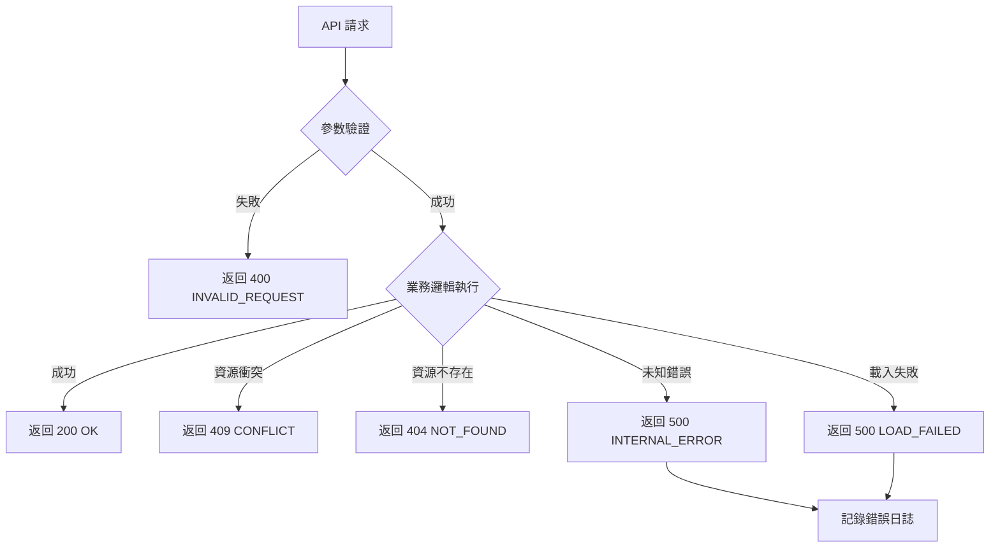

# 錯誤處理與狀態碼

本章節說明系統的錯誤處理機制與 HTTP 狀態碼使用規範。

---

## HTTP 狀態碼對應

| HTTP 狀態碼 | 說明 | 使用情境 |
|------------|------|---------|
| **200 OK** | 請求成功 | 所有成功的操作 |
| **400 Bad Request** | 請求參數錯誤 | 參數格式錯誤、缺少必填欄位 |
| **401 Unauthorized** | 未認證 | 未提供認證資訊或認證失敗 |
| **403 Forbidden** | 無權限 | 已認證但無權限執行操作 |
| **404 Not Found** | 資源不存在 | JAR/Endpoint/Controller 不存在 |
| **409 Conflict** | 資源衝突 | Publish URI 重複、JAR 使用中 |
| **500 Internal Server Error** | 伺服器錯誤 | 類別載入失敗、資料庫錯誤 |

---

## 錯誤碼分類

### 客戶端錯誤（4xx）

| 錯誤碼 | HTTP 狀態 | 說明 | 解決建議 |
|--------|----------|------|---------|
| `INVALID_REQUEST` | 400 | 請求參數無效 | 檢查請求參數格式 |
| `PUBLISH_URI_EXISTS` | 409 | Publish URI 已存在 | 使用不同的 URI 或刪除既有記錄 |
| `BEAN_NAME_EXISTS` | 409 | Bean Name 已存在 | 使用不同的 Bean Name |
| `JAR_FILE_NOT_FOUND` | 404 | JAR 檔案不存在 | 確認 JAR File ID 正確 |
| `ENDPOINT_NOT_FOUND` | 404 | Endpoint 不存在 | 確認 Endpoint ID 正確 |
| `CONTROLLER_NOT_FOUND` | 404 | Controller 不存在 | 確認 Controller ID 正確 |
| `JAR_IN_USE` | 409 | JAR 使用中 | 先停用所有使用此 JAR 的服務 |
| `ENDPOINT_ACTIVE` | 409 | Endpoint 啟用中 | 先停用 Endpoint |

### 伺服器錯誤（5xx）

| 錯誤碼 | HTTP 狀態 | 說明 | 解決建議 |
|--------|----------|------|---------|
| `CLASS_NOT_FOUND` | 500 | 類別不存在 | 確認 Class Path 正確且 JAR 包含該類別 |
| `LOAD_FAILED` | 500 | 類別載入失敗 | 檢查 JAR 檔案完整性與類別相依性 |
| `PUBLISH_FAILED` | 500 | 服務發布失敗 | 檢查 CXF 配置與路由註冊 |
| `INTERNAL_ERROR` | 500 | 系統內部錯誤 | 聯絡系統管理員 |

---

## 錯誤回應格式

### 標準錯誤結構

```json
{
  "success": false,
  "error": {
    "code": "ERROR_CODE",
    "message": "錯誤訊息",
    "details": {
      // 額外錯誤細節（可選）
    }
  },
  "timestamp": "2026-01-02T10:30:00Z",
  "path": "/dynamic-api/ws/saveWebService"
}
```

### 錯誤回應範例

#### 參數驗證錯誤

```json
{
  "success": false,
  "error": {
    "code": "INVALID_REQUEST",
    "message": "請求參數驗證失敗",
    "details": {
      "publishUri": "Publish URI 必須以 / 開頭",
      "classPath": "Class Path 格式錯誤"
    }
  },
  "timestamp": "2026-01-02T10:30:00Z",
  "path": "/dynamic-api/ws/saveWebService"
}
```

#### 資源衝突錯誤

```json
{
  "success": false,
  "error": {
    "code": "PUBLISH_URI_EXISTS",
    "message": "Publish URI '/ws/company' 已存在"
  },
  "timestamp": "2026-01-02T10:30:00Z",
  "path": "/dynamic-api/ws/saveWebService"
}
```

#### 載入失敗錯誤

```json
{
  "success": false,
  "error": {
    "code": "CLASS_NOT_FOUND",
    "message": "類別 'com.company.webservice.impl.CompanyWebServiceImpl' 不存在於 JAR 中",
    "details": {
      "jarFileName": "company-endpoint.jar",
      "classPath": "com.company.webservice.impl.CompanyWebServiceImpl"
    }
  },
  "timestamp": "2026-01-02T10:30:00Z",
  "path": "/dynamic-api/ws/switchWebService"
}
```

---

## 全域例外處理

### 實作範例

```java
@ControllerAdvice
public class GlobalExceptionHandler {

    @ExceptionHandler(PublishUriExistsException.class)
    public ResponseEntity<ErrorResponse> handlePublishUriExists(
        PublishUriExistsException ex,
        HttpServletRequest request
    ) {
        ErrorResponse error = ErrorResponse.builder()
            .success(false)
            .error(ErrorDetail.builder()
                .code("PUBLISH_URI_EXISTS")
                .message(ex.getMessage())
                .build())
            .timestamp(LocalDateTime.now())
            .path(request.getRequestURI())
            .build();

        return ResponseEntity.status(HttpStatus.CONFLICT).body(error);
    }

    @ExceptionHandler(ClassNotFoundException.class)
    public ResponseEntity<ErrorResponse> handleClassNotFound(
        ClassNotFoundException ex,
        HttpServletRequest request
    ) {
        ErrorResponse error = ErrorResponse.builder()
            .success(false)
            .error(ErrorDetail.builder()
                .code("CLASS_NOT_FOUND")
                .message("類別載入失敗：" + ex.getMessage())
                .build())
            .timestamp(LocalDateTime.now())
            .path(request.getRequestURI())
            .build();

        return ResponseEntity.status(HttpStatus.INTERNAL_SERVER_ERROR).body(error);
    }

    @ExceptionHandler(Exception.class)
    public ResponseEntity<ErrorResponse> handleGenericException(
        Exception ex,
        HttpServletRequest request
    ) {
        // 記錄完整 Stack Trace
        log.error("未預期的錯誤", ex);

        // 返回通用錯誤訊息（避免洩漏內部資訊）
        ErrorResponse error = ErrorResponse.builder()
            .success(false)
            .error(ErrorDetail.builder()
                .code("INTERNAL_ERROR")
                .message("系統內部錯誤，請聯絡管理員")
                .build())
            .timestamp(LocalDateTime.now())
            .path(request.getRequestURI())
            .build();

        return ResponseEntity.status(HttpStatus.INTERNAL_SERVER_ERROR).body(error);
    }
}
```

---

## 錯誤處理流程圖



---

## 前端錯誤處理建議

### Axios 攔截器

```javascript
import axios from 'axios';

// 回應攔截器
axios.interceptors.response.use(
  (response) => response,
  (error) => {
    const errorResponse = error.response?.data;

    // 顯示錯誤訊息
    if (errorResponse?.error) {
      const { code, message } = errorResponse.error;

      // 根據錯誤碼顯示不同提示
      switch (code) {
        case 'PUBLISH_URI_EXISTS':
          alert(`錯誤：${message}\n建議使用不同的 Publish URI`);
          break;
        case 'JAR_IN_USE':
          alert(`錯誤：${message}\n請先停用所有使用此 JAR 的服務`);
          break;
        default:
          alert(`錯誤：${message}`);
      }
    }

    return Promise.reject(error);
  }
);
```

### 錯誤處理組件

```typescript
interface ErrorDisplayProps {
  error: ApiError;
}

const ErrorDisplay: React.FC<ErrorDisplayProps> = ({ error }) => {
  const getSuggestion = (code: string) => {
    const suggestions = {
      'PUBLISH_URI_EXISTS': '建議使用不同的 Publish URI 或刪除既有 Endpoint',
      'JAR_IN_USE': '請先停用所有使用此 JAR 的服務',
      'CLASS_NOT_FOUND': '請確認 Class Path 正確且 JAR 包含該類別',
      // ...
    };
    return suggestions[code] || '請聯絡系統管理員';
  };

  return (
    <Alert severity="error">
      <AlertTitle>{error.message}</AlertTitle>
      <Typography variant="body2">
        {getSuggestion(error.code)}
      </Typography>
    </Alert>
  );
};
```

---

## 日誌記錄

### 錯誤日誌格式

```
2026-01-02 10:30:00.123 [http-nio-8080-exec-1] ERROR c.d.c.GlobalExceptionHandler - 類別載入失敗
java.lang.ClassNotFoundException: com.company.webservice.impl.CompanyWebServiceImpl
  at java.base/java.net.URLClassLoader.findClass(URLClassLoader.java:476)
  at java.base/java.lang.ClassLoader.loadClass(ClassLoader.java:594)
  at com.dynamicapi.util.DynamicClassLoader.loadClass(DynamicClassLoader.java:45)
  ...
Request: POST /dynamic-api/ws/switchWebService?id=1
User: admin
```

### 日誌級別使用

| 級別 | 使用情境 |
|------|---------|
| **ERROR** | 系統錯誤、例外狀況 |
| **WARN** | 業務規則驗證失敗、資源衝突 |
| **INFO** | 正常操作（啟用/停用服務） |
| **DEBUG** | 詳細除錯資訊 |

---

## 參考資源

- HTTP 狀態碼：https://developer.mozilla.org/zh-TW/docs/Web/HTTP/Status
- RESTful API 錯誤處理最佳實踐：https://restfulapi.net/http-status-codes/
