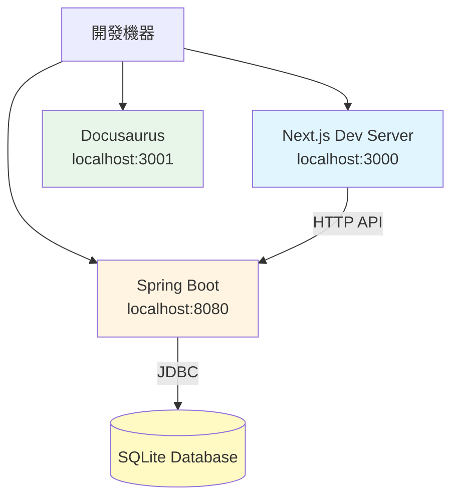
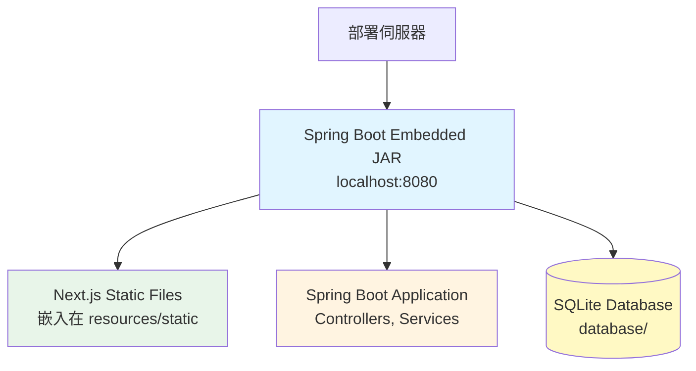

# 8.1 部署概述

Dynamic API Manager 的完整部署策略與環境配置說明。

## 部署模式

系統支援兩種主要部署模式：

| 模式 | 說明 | 適用場景 | Port 配置 |
|------|------|---------|----------|
| **開發模式** | 前後端分離，支援熱更新 | 本地開發、除錯 | 前端:3000, 後端:8080, 文檔:3001 |
| **生產模式** | 單一 JAR 部署，前端整合 | 測試環境、生產環境 | 統一:8080 |

## 開發模式部署

### 架構圖



### 啟動步驟

#### 1. 啟動後端服務

```bash
cd backend
.\gradlew.bat bootRun
```

**預期輸出**：
```
Started DynamicApiApplication in 5.123 seconds
Tomcat started on port(s): 8080
```

#### 2. 啟動前端服務

```bash
cd nextjs-dynamic-api-manager
npm install  # 首次需要
npm run dev
```

**預期輸出**：
```
ready - started server on 0.0.0.0:3000
```

#### 3. 啟動文檔服務（可選）

```bash
cd website
npm install  # 首次需要
npm start -- --port 3001
```

**預期輸出**：
```
[SUCCESS] Docusaurus website is running at: http://localhost:3001/
```

### 訪問地址

| 服務 | 地址 | 說明 |
|------|------|------|
| 前端管理介面 | http://localhost:3000/endpoint | Endpoint 管理頁面 |
| 後端 API | http://localhost:8080/dynamic-api | API 端點 |
| 線上文檔 | http://localhost:3001 | Docusaurus 文檔網站 |

## 生產模式部署

### 架構圖



### 建置步驟

```bash
cd backend
.\gradlew.bat clean bootJar
```

**自動執行的任務**：
1. `cleanNextjs` - 清除前端建置產物
2. `installNextjs` - 執行 `npm install`
3. `buildNextjs` - 執行 `npm run build`（NODE_ENV=production）
4. `copyNextjsBuild` - 複製前端產物到 `resources/static/`
5. `bootJar` - 打包 Spring Boot JAR

**產物位置**：
```
backend/build/libs/backend-0.0.1-SNAPSHOT.jar
```

### 執行步驟

```bash
cd backend/build/libs
java -jar backend-0.0.1-SNAPSHOT.jar
```

**預期輸出**：
```
Started DynamicApiApplication in 8.456 seconds
Tomcat started on port(s): 8080
```

### 訪問地址

| 服務 | 地址 | 說明 |
|------|------|------|
| 前端管理介面 | http://localhost:8080/dynamic-api/endpoint | Endpoint 管理頁面 |
| 後端 API | http://localhost:8080/dynamic-api | API 端點 |

## Port 配置總覽

### 開發模式

| 服務 | 預設 Port | 建議 Port | 說明 |
|------|----------|----------|------|
| 後端 | 8080 | 8080 | Spring Boot |
| 前端 | 3000 | 3000 | Next.js Dev Server |
| 文檔 | 3000 | **3001** | Docusaurus（避免與前端衝突）|

:::warning Port 衝突
Next.js 與 Docusaurus 預設都使用 port 3000，建議修改 Docusaurus 為 port 3001。
:::

### 生產模式

| 服務 | Port | 說明 |
|------|------|------|
| 整合應用 | 8080 | 前後端整合在單一 JAR |

## 環境需求

### 開發環境

| 軟體 | 版本要求 | 用途 |
|------|---------|------|
| **Java** | OpenJDK 17+ | 後端執行環境 |
| **Node.js** | 22+ | 前端建置與執行 |
| **Gradle** | 8.7+ | 後端建置工具 |
| **Git** | 最新版 | 版本控制 |

### 生產環境

| 軟體 | 版本要求 | 用途 |
|------|---------|------|
| **Java** | OpenJDK 17+ | JAR 執行環境 |

:::tip 最小化部署
生產環境僅需 Java 執行環境，無需安裝 Node.js、Gradle 等開發工具。
:::

## 相關文件

_其他部署相關章節將在後續補充_
