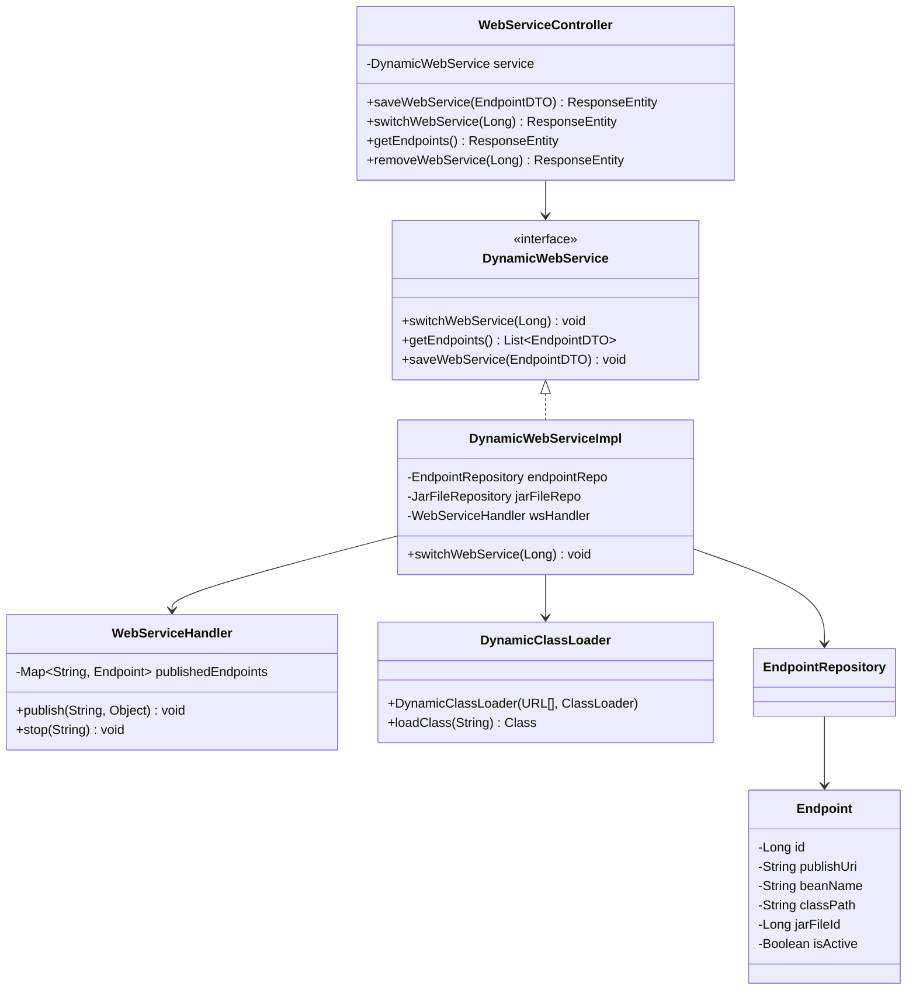
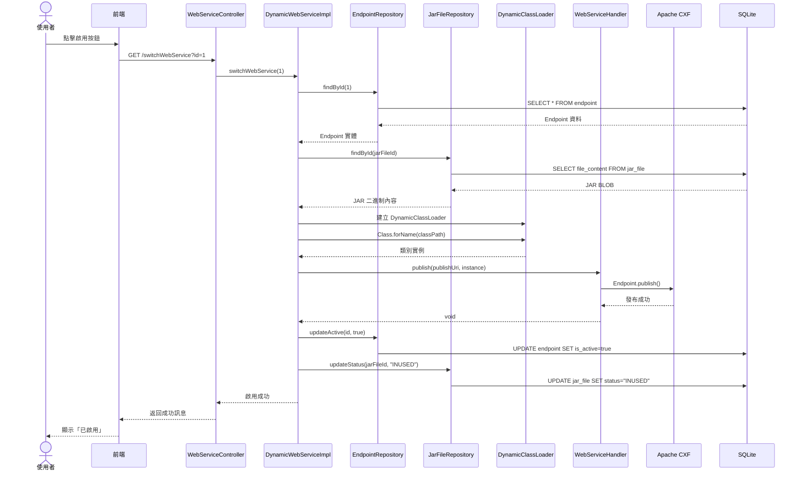

# 3.3 Endpoint 管理模組 (WSDL Web Service)

## 模組職責與功能

### 核心職責

- 新增、編輯、刪除、查詢 Endpoint 配置
- **啟用 Endpoint**:從 JAR 載入類別並使用 Apache CXF 發布 Web Service
- **停用 Endpoint**:停止發布 Web Service
- 更新 JAR 檔案狀態 (啟用時設為 INUSED,刪除時檢查並更新為 UNUSED)

### 邊界定義

**不負責的事項**:
- Mock 回應的管理 (由 Mock 回應模組負責)
- WSDL 檔案的產生 (由 Apache CXF 自動產生)

## 核心類別與介面

### 類別清單

| 類別名稱 | 類型 | 職責 |
|---------|------|------|
| `WebServiceController` | Controller | 處理 Endpoint 管理 API 請求 |
| `DynamicWebServiceImpl` | Service | Endpoint 動態載入業務邏輯 |
| `Endpoint` | Entity | Endpoint 實體 (JPA) |
| `EndpointRepository` | Repository | Endpoint 資料存取 (JPA) |
| `EndpointJDBC` | JDBC | Endpoint 複雜查詢 (JDBC) |
| `DynamicClassLoader` | Utility | 從 JAR 載入類別 |
| `WebServiceHandler` | Utility | 管理 Apache CXF Endpoint 生命週期 |
| `Wsdl2JavaUtil` | Utility | WSDL 轉 Java 工具 |

### 類別關係圖



## 關鍵方法與演算法

### 啟用 Endpoint 流程

**方法簽名**:
```java
public void switchWebService(Long endpointId) throws Exception
```

**完整流程**:

```java
1. 查詢 Endpoint 實體 (by ID)
2. 檢查 is_active 狀態:

   if (is_active == false) {  // 執行啟用邏輯
       3.1 查詢關聯的 JAR 檔案 (by jar_file_id)
       3.2 從資料庫讀取 jar_file.file_content (BLOB)
       3.3 建立臨時檔案儲存 JAR 內容
       3.4 建立 DynamicClassLoader 實例:
           URL[] urls = { tempJar.toUri().toURL() };
           DynamicClassLoader loader = new DynamicClassLoader(urls, parent);
       3.5 載入類別:
           Class<?> clazz = Class.forName(classPath, true, loader);
       3.6 實例化類別:
           Object instance = clazz.getDeclaredConstructor().newInstance();
       3.7 使用 WebServiceHandler 發布:
           wsHandler.publish(publishUri, instance);
       3.8 更新 endpoint.is_active = true
       3.9 更新 jar_file.status = "INUSED"
       3.10 清理臨時檔案

   } else if (is_active == true) {  // 執行停用邏輯
       4.1 使用 WebServiceHandler 停止發布:
           wsHandler.stop(publishUri);
       4.2 更新 endpoint.is_active = false
       4.3 檢查 JAR 是否被其他 Endpoint/Restful 使用:
           if (無其他使用者) {
               更新 jar_file.status = "UNUSED"
           }
   }

5. 返回成功訊息
```

**錯誤處理**:

| 異常類型 | 觸發條件 | 處理方式 |
|---------|---------|---------|
| `ClassNotFoundException` | JAR 中找不到指定類別 | 回滾狀態,返回錯誤訊息 |
| `InstantiationException` | 類別無法實例化 | 回滾狀態,返回錯誤訊息 |
| `PublishException` | CXF 發布失敗 | 回滾狀態,清理 ClassLoader |
| `PublishUriExistsException` | 發布路徑已存在 | 阻止啟用,返回錯誤 |

### WebServiceHandler 實作

**核心職責**:管理 Apache CXF Endpoint 的生命週期

```java
@Component
public class WebServiceHandler {

    // 儲存已發布的 Endpoint 實例
    private final Map<String, jakarta.xml.ws.Endpoint> publishedEndpoints =
        new ConcurrentHashMap<>();

    /**
     * 發布 Web Service
     * @param publishUri 發布路徑 (如: /ws/company)
     * @param serviceInstance 服務實例
     */
    public void publish(String publishUri, Object serviceInstance) {
        // 檢查路徑是否已發布
        if (publishedEndpoints.containsKey(publishUri)) {
            throw new PublishUriExistsException(
                "Publish URI already exists: " + publishUri
            );
        }

        // 使用 Apache CXF 發布
        String fullUrl = "http://localhost:8080" + publishUri;
        jakarta.xml.ws.Endpoint endpoint =
            jakarta.xml.ws.Endpoint.publish(fullUrl, serviceInstance);

        // 儲存實例供後續停用使用
        publishedEndpoints.put(publishUri, endpoint);

        log.info("Web Service published at: {}", fullUrl);
    }

    /**
     * 停止 Web Service
     * @param publishUri 發布路徑
     */
    public void stop(String publishUri) {
        jakarta.xml.ws.Endpoint endpoint = publishedEndpoints.get(publishUri);
        if (endpoint != null) {
            endpoint.stop();
            publishedEndpoints.remove(publishUri);
            log.info("Web Service stopped: {}", publishUri);
        }
    }
}
```

### DynamicClassLoader 實作

**核心目的**:隔離不同 JAR 的類別,避免衝突

```java
public class DynamicClassLoader extends URLClassLoader {

    public DynamicClassLoader(URL[] urls, ClassLoader parent) {
        super(urls, parent);
    }

    @Override
    protected Class<?> loadClass(String name, boolean resolve)
        throws ClassNotFoundException {

        synchronized (getClassLoadingLock(name)) {
            // 檢查是否已載入
            Class<?> c = findLoadedClass(name);

            if (c == null) {
                try {
                    // 優先從當前 JAR 載入 (打破雙親委派)
                    c = findClass(name);
                } catch (ClassNotFoundException e) {
                    // 若載入失敗,委派給父 ClassLoader
                    c = super.loadClass(name, resolve);
                }
            }

            if (resolve) {
                resolveClass(c);
            }

            return c;
        }
    }
}
```

**設計決策**:
- 打破雙親委派模型,優先載入 JAR 中的類別
- 確保不同 JAR 的同名類別可共存
- 透過 `ClassLoaderSingletonEnum` 管理多個實例

## 與其他模組的互動

### 依賴模組

| 模組 | 互動方式 | 說明 |
|------|---------|------|
| **JAR 管理** | 查詢 JAR、更新狀態 | 啟用時讀取 JAR 內容,更新狀態為 INUSED |
| **Mock 回應** | 間接依賴 (透過 base-jar) | 動態載入的服務透過 WebserviceBase 查詢回應 |

### 互動序列圖



## 資料模型

### Endpoint Entity

```java
@Entity
@Table(name = "endpoint")
public class Endpoint {
    @Id
    @GeneratedValue(strategy = GenerationType.IDENTITY)
    private Long id;

    @Column(name = "publish_uri", nullable = false, unique = true)
    private String publishUri;

    @Column(name = "bean_name", nullable = false, unique = true)
    private String beanName;

    @Column(name = "class_path", nullable = false)
    private String classPath;

    @Column(name = "jar_file_id", nullable = false)
    private Long jarFileId;

    @Column(name = "is_active", nullable = false)
    private Boolean isActive = false;

    @Column(name = "create_time", nullable = false)
    private LocalDateTime createTime;

    // Getters and Setters
}
```

## 設計考量

### 為何使用 DynamicClassLoader?

**優點**:
1. **類別隔離**:不同 JAR 的同名類別不衝突
2. **多版本支援**:可同時載入不同版本的類別
3. **卸載支援**:理論上可透過 GC 釋放 (需驗證)

**風險**:
- **記憶體洩漏**:ClassLoader 可能無法被 GC 回收
- **除錯困難**:ClassLoader 相關問題難以追查

**緩解措施**:
- 定期監控 JVM 記憶體
- 限制同時載入的 JAR 數量

### WSDL 存取方式

啟用 Endpoint 後,外部系統可透過以下方式存取 WSDL:

```
GET http://localhost:8080/{publishUri}?wsdl
```

範例:
```
GET http://localhost:8080/ws/company?wsdl
```

返回 WSDL XML 文件。

## 相關文件

- [JAR 檔案管理模組](jar-module)
- [業務流程設計](../workflows/endpoint-loading)
