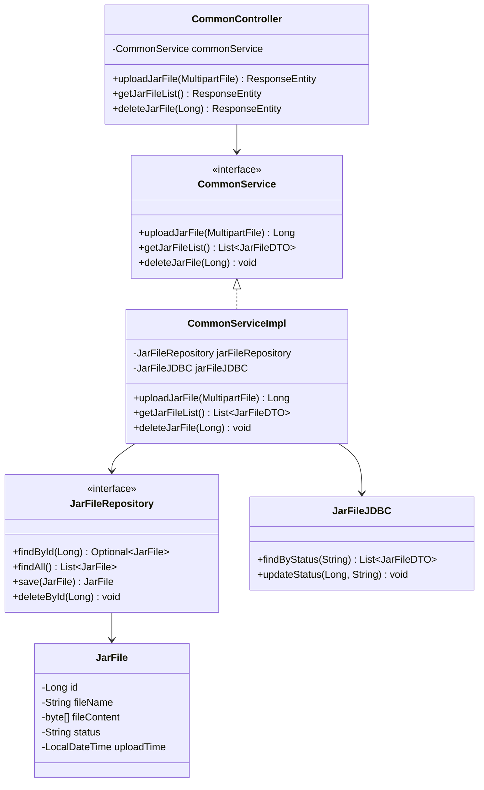
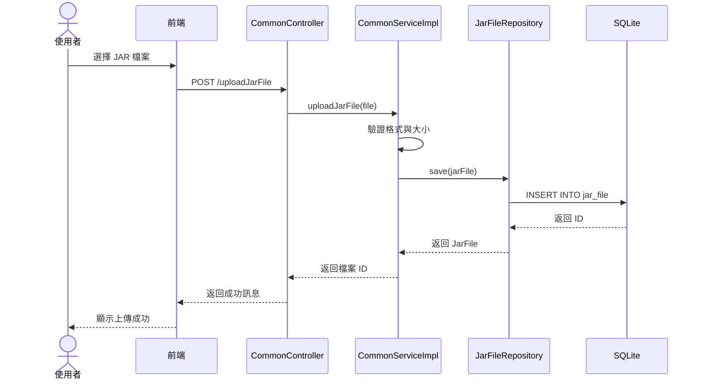

# 3.2 JAR 檔案管理模組

## 模組職責與功能

### 核心職責

- 接收使用者上傳的 JAR 檔案
- 將 JAR 內容以 BLOB 格式儲存到資料庫
- 提供 JAR 檔案清單查詢
- 管理 JAR 檔案狀態 (`UNUSED` / `INUSED`)
- 刪除未使用的 JAR 檔案

### 邊界定義

**不負責的事項**:
- JAR 內容的驗證 (由動態載入模組負責)
- JAR 的解析與類別載入
- JAR 的病毒掃描 (<!-- TODO: 待整合 -->)

## 核心類別與介面

### 類別清單

| 類別名稱 | 類型 | 職責 |
|---------|------|------|
| `CommonController` | Controller | 處理 JAR 上傳 API 請求 |
| `CommonServiceImpl` | Service | JAR 檔案管理業務邏輯 |
| `JarFile` | Entity | JAR 檔案實體 (JPA) |
| `JarFileRepository` | Repository | JAR 檔案資料存取 (JPA) |
| `JarFileJDBC` | JDBC | JAR 檔案複雜查詢 (JDBC) |

### 類別關係圖



## 關鍵方法與演算法

### 上傳 JAR 檔案

**方法簽名**:
```java
public Long uploadJarFile(MultipartFile file) throws Exception
```

**處理流程**:
```java
1. 驗證檔案格式 (.jar 副檔名)
2. 驗證檔案大小 (< 50MB)
3. 讀取檔案二進制內容
4. 檢查檔案名稱是否重複
   - 若重複,自動加上時間戳記
5. 建立 JarFile 實體:
   - fileName: 檔案名稱
   - fileContent: 二進制內容 (BLOB)
   - status: "UNUSED"
   - uploadTime: 當前時間
6. 儲存到資料庫
7. 返回檔案 ID
```

**錯誤處理**:
- 檔案格式錯誤 → 拋出 `InvalidFileFormatException`
- 檔案過大 → 拋出 `FileSizeExceededException`
- 資料庫儲存失敗 → 拋出 `DataAccessException`

### 查詢 JAR 檔案清單

**方法簽名**:
```java
public List<JarFileDTO> getJarFileList()
```

**SQL 查詢**:
```sql
SELECT
    id,
    file_name,
    status,
    upload_time
FROM jar_file
ORDER BY upload_time DESC
```

**注意事項**:
- 不返回 `file_content` (BLOB),避免記憶體消耗
- 使用 DTO 模式,避免暴露 Entity

### 刪除 JAR 檔案

**方法簽名**:
```java
public void deleteJarFile(Long id) throws Exception
```

**處理流程**:
```java
1. 查詢 JAR 檔案是否存在
2. 檢查 status 是否為 "UNUSED"
   - 若為 "INUSED",拋出異常
3. 刪除資料庫記錄
4. 返回成功
```

**業務規則**:
- 僅允許刪除 `status = "UNUSED"` 的檔案
- 刪除前需確認沒有 Endpoint/Restful 使用

### 更新 JAR 狀態

**方法簽名**:
```java
public void updateJarStatus(Long id, String status)
```

**呼叫時機**:
- Endpoint/Restful 啟用時 → 更新為 "INUSED"
- Endpoint/Restful 刪除時 → 檢查是否還有其他使用者,若無則更新為 "UNUSED"

**SQL 範例**:
```sql
UPDATE jar_file
SET status = ?
WHERE id = ?
```

## 與其他模組的互動

### 被依賴模組

| 模組 | 互動方式 | 說明 |
|------|---------|------|
| **Endpoint 管理** | 查詢 JAR 清單、更新狀態 | 啟用 Endpoint 時查詢 JAR,更新狀態為 INUSED |
| **Restful 管理** | 查詢 JAR 清單、更新狀態 | 啟用 Restful 時查詢 JAR,更新狀態為 INUSED |

### 互動序列圖



## 資料模型

### JarFile Entity

```java
@Entity
@Table(name = "jar_file")
public class JarFile {
    @Id
    @GeneratedValue(strategy = GenerationType.IDENTITY)
    private Long id;

    @Column(name = "file_name", nullable = false, unique = true)
    private String fileName;

    @Lob
    @Column(name = "file_content", nullable = false)
    private byte[] fileContent;

    @Column(name = "status", nullable = false)
    private String status; // UNUSED, INUSED

    @Column(name = "upload_time", nullable = false)
    private LocalDateTime uploadTime;

    // Getters and Setters
}
```

### JarFileDTO

```java
public class JarFileDTO {
    private Long id;
    private String fileName;
    private String status;
    private LocalDateTime uploadTime;

    // 不包含 fileContent,避免記憶體消耗
}
```

## 設計考量

### 為何儲存為 BLOB 而非檔案系統?

**優點**:
1. **交易一致性**:JAR 與配置資料在同一資料庫,ACID 保證
2. **簡化管理**:無需處理檔案路徑、權限、清理
3. **備份便利**:備份資料庫即可

**缺點**:
1. **資料庫膨脹**:BLOB 會增加資料庫大小
2. **讀取效能**:比檔案系統慢 (可透過快取優化)

**結論**:初版採用 BLOB,未來若效能不足可考慮外部儲存 (如 MinIO)

### 狀態管理策略

- **UNUSED**:JAR 上傳後的初始狀態,可被刪除
- **INUSED**:至少被一個 Endpoint/Restful 使用,不可刪除
- 狀態由 Endpoint/Restful 模組負責更新

## 相關文件

- [Endpoint 管理模組](./endpoint-module.md)
- [Restful 管理模組](./restful-module.md)
- [資料庫 Schema](../database/schema.md)
