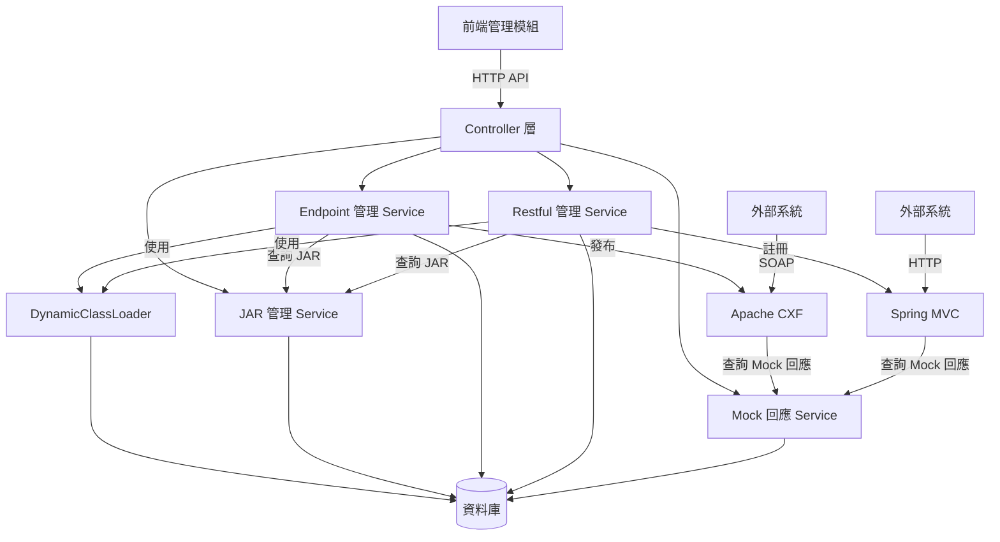

# 3.1 模組概述

本章描述 Dynamic API Manager 的模組化設計原則與模組間互動關係。

## 模組化設計原則

### 分層架構

系統採用經典的分層架構,確保職責分離:

```
┌─────────────────────────────────────────┐
│          Controller 層                  │  ← HTTP 請求處理
├─────────────────────────────────────────┤
│          Service 層                     │  ← 業務邏輯
├─────────────────────────────────────────┤
│          Repository 層                  │  ← 資料存取 (JPA)
├─────────────────────────────────────────┤
│          JDBC 層                        │  ← 複雜查詢 (JDBC)
├─────────────────────────────────────────┤
│          Utility 層                     │  ← 工具類別
└─────────────────────────────────────────┘
```

### 核心設計原則

1. **單一職責原則 (SRP)**:每個模組負責一個明確的業務領域
2. **低耦合高內聚**:模組間透過介面通訊,減少直接依賴
3. **可替換性**:各層可獨立替換實作 (如更換資料庫)
4. **可測試性**:每個模組可獨立進行單元測試

## 核心模組清單

| 模組名稱 | 職責 | 對應章節 |
|---------|------|---------|
| **JAR 檔案管理模組** | 上傳、儲存、查詢、刪除 JAR 檔案 | 3.2 |
| **Endpoint 管理模組** | WSDL Web Service 動態載入與發布 | 3.3 |
| **Restful 管理模組** | RESTful API Controller 動態載入與註冊 | 3.4 |
| **Mock 回應管理模組** | Mock 回應規則管理與匹配邏輯 | 3.5 |
| **前端管理模組** | Web 管理介面 | 3.6 |

## 模組間互動關係

### 整體互動圖



### 依賴關係

- **前端模組** → 後端所有 Controller
- **Endpoint 管理** → JAR 管理 (查詢 JAR、更新狀態)
- **Restful 管理** → JAR 管理 (查詢 JAR、更新狀態)
- **動態載入的服務** → Mock 回應管理 (透過 base-jar)

### 資料流向

1. **JAR 上傳流程**:
   ```
   前端 → CommonController → CommonService → JarFileRepository → SQLite
   ```

2. **Endpoint 啟用流程**:
   ```
   前端 → WebServiceController → DynamicWebServiceImpl →
   JarFileRepository (讀取 JAR) → DynamicClassLoader (載入類別) →
   WebServiceHandler (發布) → Apache CXF
   ```

3. **Mock 回應匹配流程**:
   ```
   外部系統 → 動態載入的服務 → WebserviceBase/RestfulBase →
   MockResponseJDBC → SQLite → 返回回應
   ```

## 模組隔離機制

### ClassLoader 隔離

- 每個 JAR 使用獨立的 `DynamicClassLoader` 實例
- 透過 `ClassLoaderSingletonEnum` 管理多個 ClassLoader
- 確保不同 JAR 的類別不會衝突

### 資料隔離

- 不同服務的 Mock 回應透過 `publish_uri` + `service_type` 區分
- JAR 狀態透過 `status` 欄位追蹤使用情況

## 擴展性設計

### 新增服務類型

若未來需支援新的服務類型 (如 gRPC),可按以下步驟擴展:

1. 新增 Service Type 枚舉值
2. 新增對應的 Management Service
3. 新增對應的 Base Class (類似 `WebserviceBase`)
4. 實作動態載入邏輯
5. 新增前端管理頁面

### 新增功能模組

系統設計允許水平擴展,新增功能模組時:

1. 遵循現有分層架構
2. 透過 Spring 依賴注入整合
3. 保持模組間低耦合

## 相關文件

- [JAR 檔案管理模組](jar-module)
- [Endpoint 管理模組](endpoint-module)
- [Restful 管理模組](restful-module)
