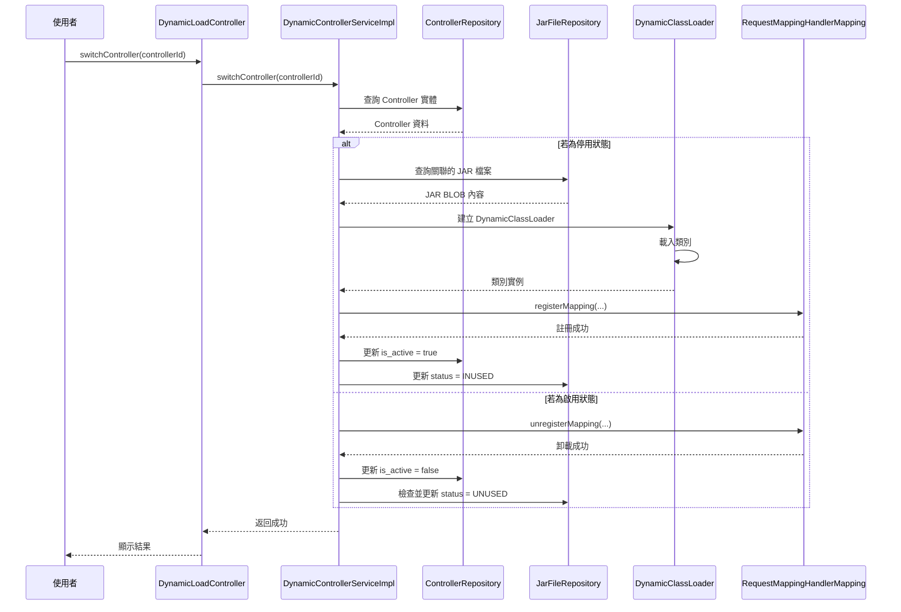
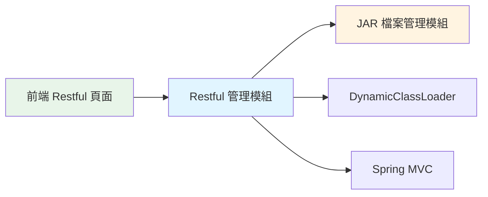

# 3.4 Restful 管理模組

RESTful API Controller 的動態載入與註冊模組。

## 職責與邊界

### 職責
- 新增、編輯、刪除、查詢 Restful Controller 配置
- 啟用 Controller：從 JAR 載入類別並使用 Spring RequestMappingHandlerMapping 註冊路由
- 停用 Controller：卸載路由
- 更新 JAR 檔案狀態

### 邊界
- ❌ 不負責 Mock 回應的管理
- ❌ 不負責 API 文件產生（未來可整合 Springdoc）

## 主要類別清單

| 類別 | 類型 | 職責 |
|------|------|------|
| **DynamicLoadController** | Controller | 處理 Restful 管理 API 請求 |
| **DynamicControllerServiceImpl** | Service | Restful 動態載入業務邏輯 |
| **Controller** | Entity | Restful Controller 實體（JPA） |
| **ControllerRepository** | Repository | Controller 資料存取（JPA） |
| **ControllerJDBC** | JDBC | Controller 複雜查詢（JDBC） |
| **DynamicClassLoader** | Utility | 從 JAR 載入類別 |
| **RequestMappingHandlerMapping** | Spring Bean | Spring MVC 路由映射管理器 |

## 核心流程：啟用 Restful Controller

### 流程步驟

### 詳細步驟說明

1. **DynamicLoadController.switchController(controllerId)**
2. **DynamicControllerServiceImpl.switchController(controllerId)**
   - a. 查詢 Controller 實體
   - b. 檢查 `is_active` 狀態
   - c. 若為停用，執行啟用邏輯：
     - i. 查詢關聯的 JAR 檔案
     - ii. 從資料庫讀取 JAR BLOB 內容
     - iii. 建立 DynamicClassLoader 實例
     - iv. 從 JAR 載入指定的類別（`Class.forName(classPath, true, classLoader)`）
     - v. 實例化類別（`Class.newInstance()`）
     - vi. 註冊到 RequestMappingHandlerMapping
       - `handlerMapping.registerMapping(requestMappingInfo, controllerInstance, method)`
     - vii. 更新 `Controller.is_active = true`
     - viii. 更新 `JarFile.status = INUSED`
   - d. 若為啟用，執行停用邏輯：
     - i. 從 RequestMappingHandlerMapping 卸載路由
       - `handlerMapping.unregisterMapping(requestMappingInfo)`
     - ii. 更新 `Controller.is_active = false`
     - iii. 檢查 JAR 是否被其他 Endpoint/Restful 使用，若否則更新 `JarFile.status = UNUSED`
3. **返回成功／失敗訊息**

## 與其他模組的關係

### 依賴關係

- **依賴**：JAR 檔案管理模組（查詢 JAR、更新狀態）
- **被依賴**：前端 Restful 管理頁面

## 關鍵設計考量

:::tip Spring MVC 動態註冊
使用 `RequestMappingHandlerMapping` 可以在運行時動態註冊路由，無需重啟應用程式。
:::

:::warning 類別載入順序
必須先載入類別，再註冊到 Spring MVC，否則會導致路由無法正確解析。
:::

## 相關文件

- [JAR 檔案管理模組](jar-module)
- [Endpoint 管理模組](endpoint-module)
