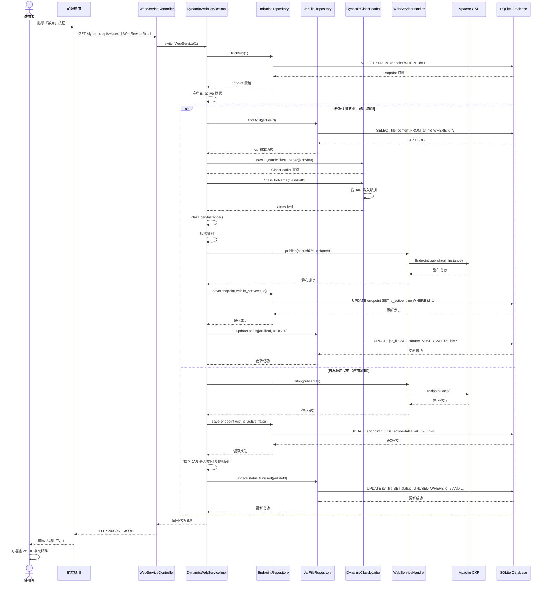
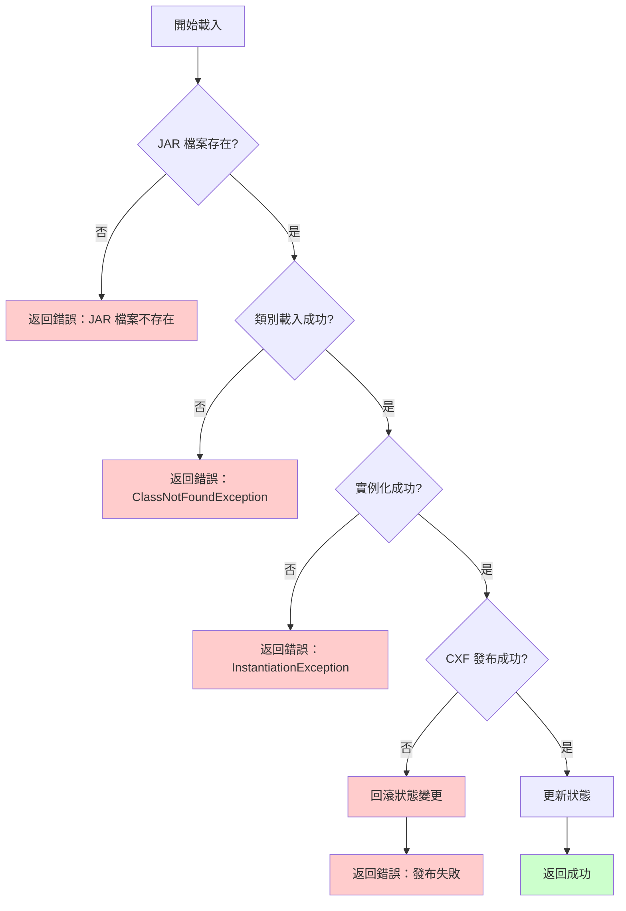

# 6.2 Endpoint 動態載入流程

WSDL Web Service 的完整動態載入與發布流程。

## 流程概述

本流程說明如何從使用者點擊「啟用」按鈕開始，到 Web Service 成功發布並可供外部系統呼叫的完整過程。

## 參與者（Actor）

| 參與者 | 職責 |
|--------|------|
| **使用者** | 透過前端介面操作 |
| **前端應用** | Next.js 管理介面 |
| **WebServiceController** | 處理 HTTP 請求 |
| **DynamicWebServiceImpl** | 實作動態載入邏輯 |
| **EndpointRepository** | Endpoint 資料存取 |
| **JarFileRepository** | JAR 檔案資料存取 |
| **DynamicClassLoader** | 動態類別載入器 |
| **WebServiceHandler** | Web Service 發布管理器 |
| **Apache CXF** | Web Service 引擎 |
| **SQLite 資料庫** | 資料持久化 |

## 完整序列圖



## 詳細步驟說明

### 步驟 1-3：請求接收
1. 使用者在前端點擊「啟用」按鈕
2. 前端呼叫 `GET /dynamic-api/ws/switchWebService?id=1`
3. `WebServiceController` 接收請求，呼叫 `DynamicWebServiceImpl.switchWebService(1)`

### 步驟 4-6：查詢 Endpoint
4. `DynamicWebServiceImpl` 查詢 Endpoint 實體（id=1）
5. 從資料庫取得 Endpoint 資料
6. 檢查 `is_active` 狀態

### 步驟 7-12：載入 JAR 與類別（若為停用）
7. 查詢關聯的 JAR 檔案（透過 `jar_file_id`）
8. 從資料庫讀取 `jar_file.file_content`（BLOB）
9. 建立 `DynamicClassLoader` 實例，傳入 JAR 二進制內容
10. 使用 `Class.forName(classPath, true, classLoader)` 載入類別
11. 使用 `clazz.getDeclaredConstructor().newInstance()` 實例化
12. 得到服務實例

### 步驟 13-15：發布 Web Service
13. 呼叫 `WebServiceHandler.publish(publishUri, serviceInstance)`
14. `WebServiceHandler` 內部呼叫 `Endpoint.publish(publishUri, serviceInstance)`（Apache CXF）
15. Web Service 發布成功

### 步驟 16-19：更新狀態
16. 更新 `endpoint.is_active = true`
17. 儲存到資料庫
18. 更新 `jar_file.status = INUSED`
19. 返回成功訊息給前端

### 步驟 20：完成
20. 前端更新狀態顯示為「已啟用」

## 異常處理流程



### 異常處理策略

| 異常類型 | 處理方式 |
|---------|---------|
| **JAR 檔案不存在** | 返回錯誤訊息，不執行後續步驟 |
| **ClassNotFoundException** | 記錄錯誤日誌，返回「類別載入失敗」訊息 |
| **InstantiationException** | 記錄錯誤日誌，返回「實例化失敗」訊息 |
| **CXF 發布失敗** | 回滾狀態變更，返回「發布失敗」訊息 |
| **資料庫錯誤** | 使用事務回滾，返回「系統錯誤」訊息 |

:::danger 重要注意事項
所有狀態更新必須在事務中執行，確保失敗時可以完整回滾。
:::

## 關鍵技術細節

### ClassLoader 建立

```java
// 從資料庫讀取 JAR BLOB
byte[] jarBytes = jarFileRepository.findById(jarFileId).getFileContent();

// 建立臨時檔案
Path tempJar = Files.createTempFile("dynamic-jar-", ".jar");
Files.write(tempJar, jarBytes);

// 建立 DynamicClassLoader
URL[] urls = { tempJar.toUri().toURL() };
DynamicClassLoader classLoader = new DynamicClassLoader(urls, ClassLoader.getSystemClassLoader());

// 載入類別
Class<?> clazz = Class.forName(classPath, true, classLoader);
Object instance = clazz.getDeclaredConstructor().newInstance();

// 清理臨時檔案
Files.delete(tempJar);
```

### Web Service 發布

```java
// 使用 Apache CXF 發布
javax.xml.ws.Endpoint endpoint = javax.xml.ws.Endpoint.publish(publishUri, serviceInstance);

// 儲存 Endpoint 實例供停用時使用
endpointMap.put(publishUri, endpoint);
```

## 效能考量

| 項目 | 預期時間 | 優化建議 |
|------|---------|---------|
| JAR BLOB 讀取 | < 500ms | 考慮加入快取機制 |
| 類別載入 | < 1s | 確保 JAR 大小 < 10MB |
| CXF 發布 | < 1s | Apache CXF 內部優化 |
| **總計** | **< 3s** | 滿足 NFR-PERF-002 要求 |

:::tip 效能優化建議
若 JAR 檔案較大（> 10MB），建議實作快取機制，避免重複從資料庫讀取 BLOB。
:::

## 相關文件

- [3.3 Endpoint 管理模組](../modules/endpoint-module)
