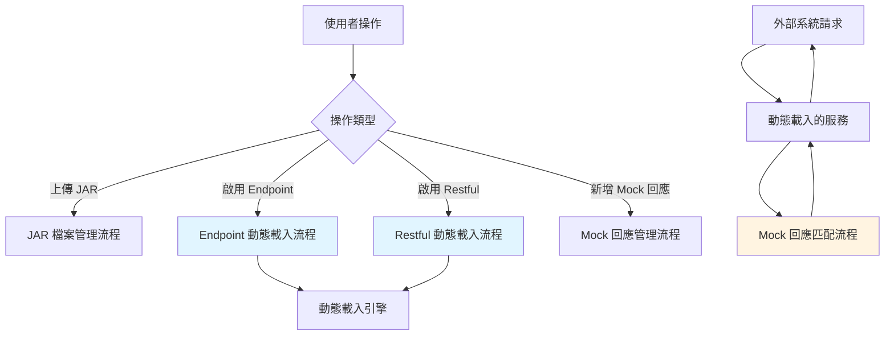

# 6.1 業務流程概述

本章節說明 Dynamic API Manager 的核心業務流程與演算法設計。

## 核心流程清單

| 流程名稱 | 說明 | 對應章節 |
|---------|------|---------|
| **Endpoint 動態載入** | WSDL Web Service 的動態載入與發布流程 | 6.2 |
| **Restful 動態載入** | RESTful API Controller 的動態載入與註冊流程 | 6.3 |
| **Mock 回應匹配** | Mock 回應規則的條件匹配與返回演算法 | 6.4 |

## 流程設計原則

### 1. 異常安全
所有流程都包含完整的異常處理機制：
- 載入失敗時回滾狀態變更
- 記錄詳細的錯誤日誌
- 向使用者返回清晰的錯誤訊息

### 2. 事務一致性
關鍵操作使用資料庫事務確保一致性：
- Endpoint/Restful 啟用操作
- JAR 狀態更新操作
- Mock 回應新增/更新操作

### 3. 可觀察性
所有流程都包含日誌記錄：
- 操作開始/完成時間
- 中間步驟執行結果
- 異常發生時的詳細資訊

## 流程互動關係

## 下一步

接下來的章節將詳細說明各流程：
- [6.2 Endpoint 動態載入流程](endpoint-loading)
