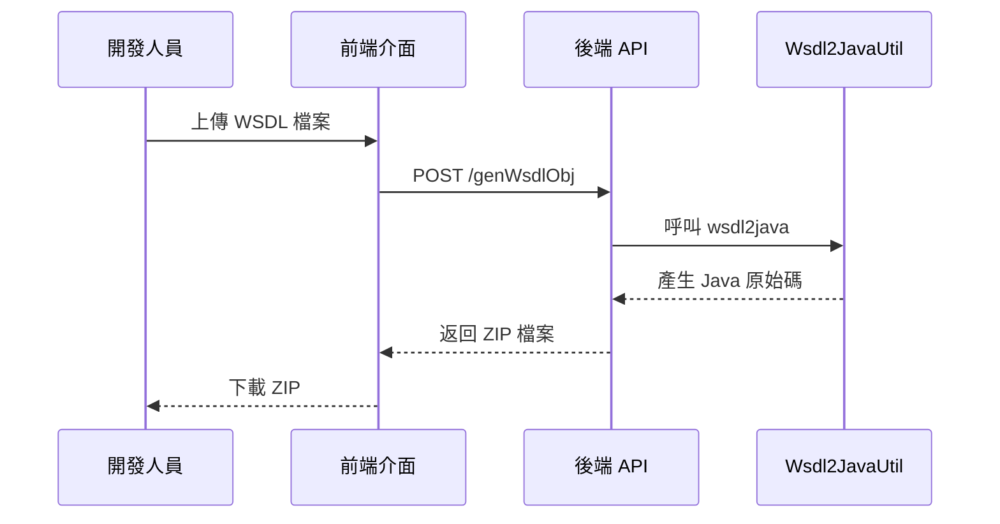

# 輔助工具模組

本模組提供開發輔助工具，協助開發人員快速建立 JAR 模組。

---

## FR-TOOL-001：WSDL 轉 Java 物件

### 描述
系統應提供 WSDL 轉 Java 工具，自動產生 Java 類別。

### 觸發者（Actor）
- 開發人員

### 前置條件
- 使用者提供有效的 WSDL 檔案或 URL

### 後置條件
- 產生 Java 類別（DTO、Service Interface）

### 輸入／輸出

**輸入**：
- WSDL 檔案或 WSDL URL

**輸出**：
- ZIP 壓縮檔（包含產生的 Java 原始碼）

### 業務規則

:::note 實作方式
使用 Apache CXF 的 `wsdl2java` 工具
:::

- 產生的類別包含：DTO、Service Interface、Exception 類別
- 類別的 package 名稱可由使用者指定（<!-- TODO: 預設規則待定 -->）

### 驗收標準

✅ **成功情境**：
- 成功產生 ZIP 檔案並可下載
- 產生的類別可正常編譯

❌ **失敗情境**：
- 無效的 WSDL 時顯示錯誤訊息

---

## 使用流程



---

## 產生的檔案結構

```
generated-sources.zip
├── com/
│   └── company/
│       ├── dto/
│       │   ├── CompanyDTO.java
│       │   └── EmployeeDTO.java
│       ├── service/
│       │   └── CompanyWebService.java
│       └── exception/
│           └── CompanyServiceException.java
└── README.txt
```

---

## 開發建議

:::tip 開發流程
1. 使用 WSDL 轉 Java 工具產生基礎類別
2. 建立新的 Gradle 專案（參考 `endpoints/company-endpoint`）
3. 複製產生的類別到專案中
4. 建立實作類別繼承 `WebserviceBase`
5. 實作 Web Service 方法，呼叫 `findByPrimaryKey()` 取得 Mock 回應
6. 建置 JAR 檔案並上傳到系統
:::
