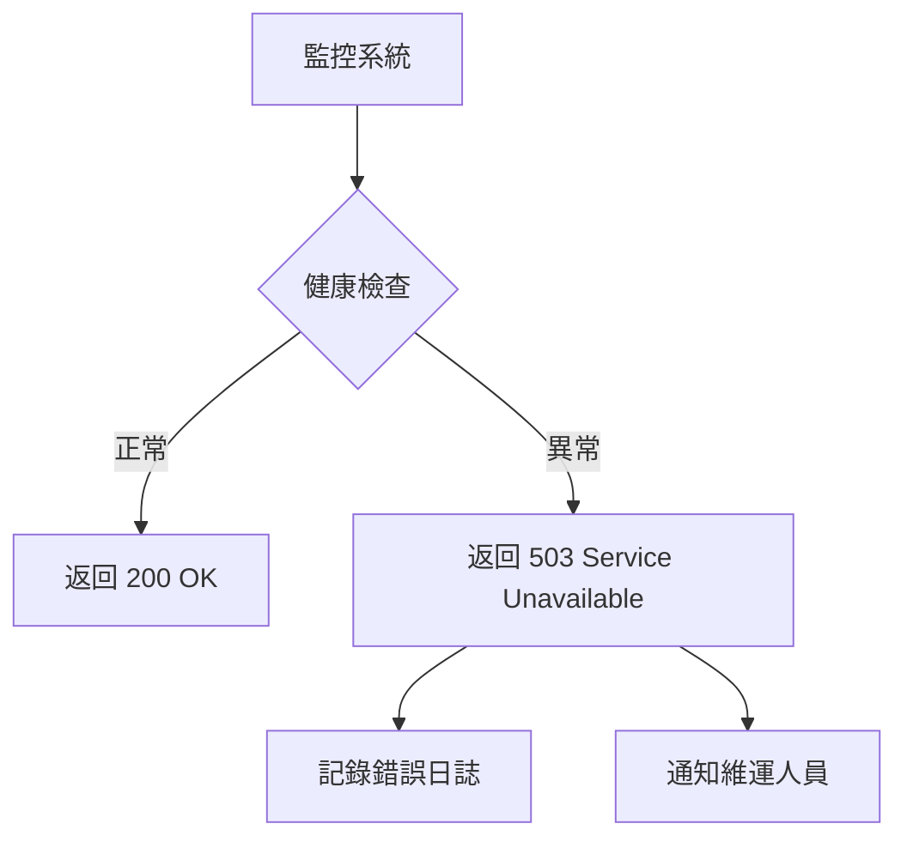
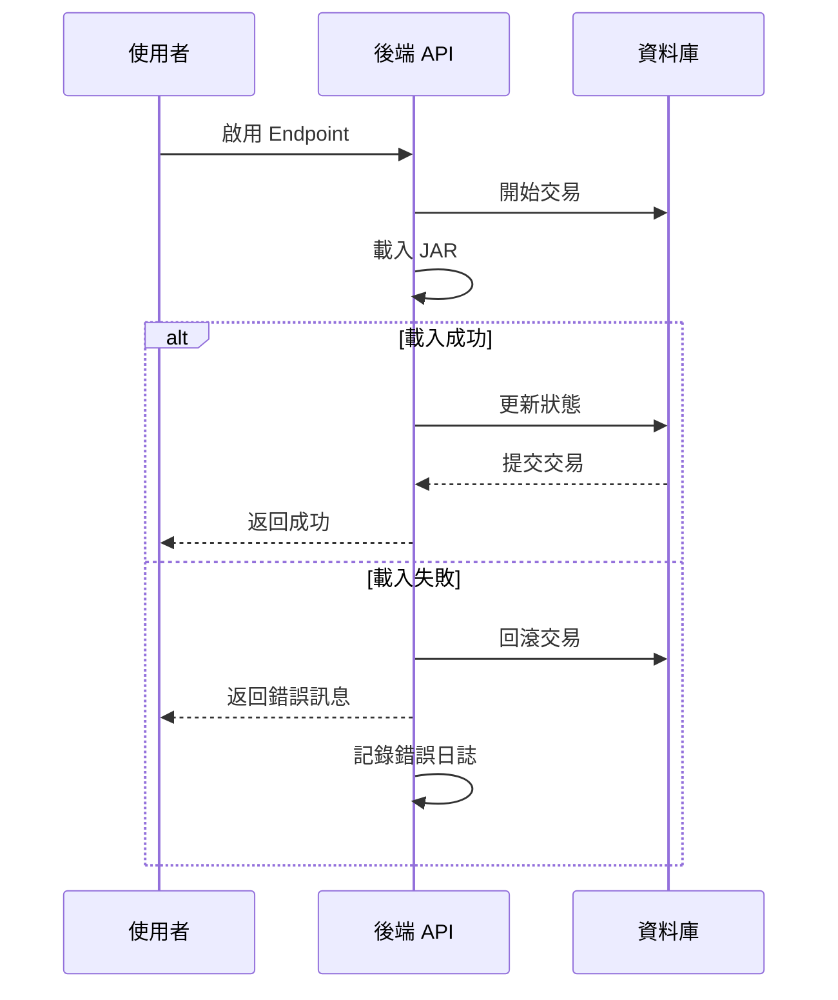

# 可用性與可靠度需求

本章節定義系統可用性與穩定性要求。

---

## NFR-AVAIL-001：系統可用性

### 描述
系統可用性應達到 99% 以上（每月停機時間 < 7.2 小時）。

### 排除範圍

:::note 計劃性維護
計劃性維護時間不計入停機時間
:::

### 驗收標準

✅ **可用性要求**：
- 關鍵錯誤導致的停機時間 < 每月 7.2 小時
- 系統提供健康檢查端點（<!-- TODO: 端點路徑待定 -->）

---

## NFR-AVAIL-002：熱部署不影響現有服務

### 描述
動態載入新的 Endpoint/Restful 時，不應影響已啟用的服務。

### 驗收標準

:::tip 隔離性要求
- 啟用新服務時，既有服務的回應時間不增加超過 10%
- 既有服務的錯誤率不增加
:::

---

## NFR-AVAIL-003：錯誤恢復

### 描述
系統應能從載入失敗中恢復，不影響整體穩定性。

### 驗收標準

✅ **容錯能力**：
- JAR 載入失敗時，記錄錯誤並回滾狀態，不導致系統崩潰
- 使用者可重試失敗的操作

---

## 可用性設計策略

### 健康檢查機制

### 錯誤處理流程

### 系統監控指標

| 指標 | 閾值 | 告警動作 |
|------|------|---------|
| CPU 使用率 | > 80% | 發送告警 |
| 記憶體使用率 | > 85% | 發送告警 |
| 磁碟空間 | < 10% | 發送告警 |
| API 錯誤率 | > 5% | 發送告警 |
| 資料庫連線數 | > 90% | 發送告警 |

:::warning 維運建議
建議整合監控工具（如：Prometheus + Grafana）進行實時監控
:::
