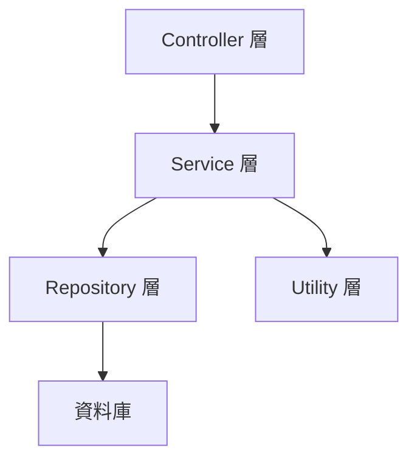
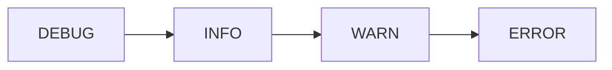
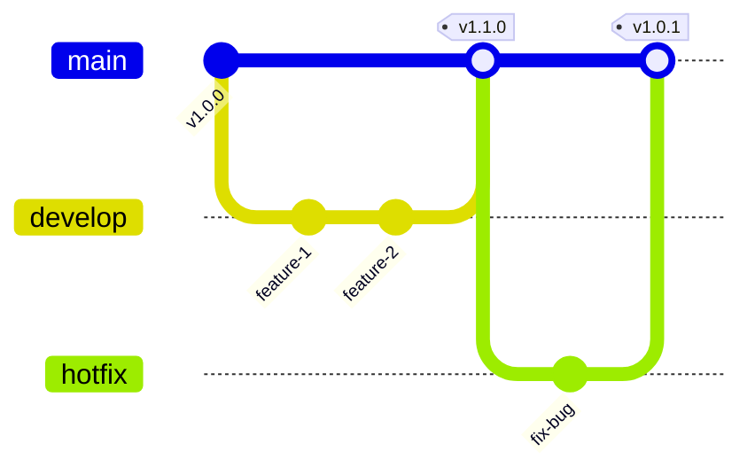

# 可維護性與可擴充性需求

本章節定義系統的可維護性與擴充性要求。

---

## NFR-MAINT-001：模組化架構

### 描述
系統應採用分層架構，模組間低耦合。

### 分層結構



### 驗收標準

:::tip 架構原則
- 每層職責明確，不跨層呼叫
- 可獨立替換某層實作（如：更換資料庫）
:::

---

## NFR-MAINT-002：日誌與追蹤

### 描述
系統應提供完整的日誌記錄與錯誤追蹤。

### 日誌內容

| 日誌類型 | 內容 |
|---------|------|
| API 請求日誌 | 時間戳記、請求路徑、狀態碼、回應時間 |
| 動態載入日誌 | 載入成功/失敗、類別名稱、JAR 檔案名稱 |
| 錯誤日誌 | Exception Stack Trace、請求參數 |

### 日誌級別



### 驗收標準

✅ **日誌要求**：
- 日誌檔案以日期輪轉（每日一個檔案）
- 日誌級別可調整（DEBUG / INFO / WARN / ERROR）
- 提供日誌查詢介面（<!-- TODO: 待評估是否需要 -->）

---

## NFR-MAINT-003：單元測試覆蓋率

### 描述
關鍵業務邏輯的單元測試覆蓋率應達到 60% 以上。

### 涵蓋範圍

| 模組 | 覆蓋率要求 |
|------|----------|
| Service 層業務邏輯 | > 60% |
| Utility 層工具類別 | > 60% |
| Repository 層資料存取 | 整合測試 |
| **關鍵功能**（動態載入、Mock 回應匹配） | **> 80%** |

### 驗收標準

:::tip 測試工具
使用 JaCoCo 工具量測覆蓋率
:::

---

## NFR-MAINT-004：API 文件

### 描述
系統應提供完整的 API 文件。

### 文件內容

| 項目 | 說明 |
|------|------|
| API 端點清單 | 所有可用的 API 端點 |
| Request / Response Schema | 請求與回應的資料結構 |
| 錯誤碼說明 | 所有錯誤碼與處理方式 |
| 範例請求 | 每個端點的使用範例 |

### 文件格式

:::note 文件工具
- **Swagger / OpenAPI 3.0**（<!-- TODO: 待整合 Springdoc -->）
- **訪問路徑**：`/swagger-ui.html`
:::

### 驗收標準

✅ **文件要求**：
- 所有 API 端點都有文件
- 文件與實際實作一致

---

## 可維護性設計建議

### 程式碼規範

```java
// 使用有意義的命名
public class DynamicWebServiceImpl implements DynamicWebService {

    // 註解說明複雜邏輯
    /**
     * 啟用 Endpoint 並發布 Web Service
     * @param endpointId Endpoint ID
     * @throws ClassNotFoundException 若類別不存在
     * @throws PublishException 若發布失敗
     */
    @Transactional
    public void switchWebService(Long endpointId) {
        // 實作邏輯...
    }
}
```

### 版本控制策略



### 重構建議

:::tip 持續改進
1. **定期重構**：每個 Sprint 分配 10% 時間重構
2. **技術債追蹤**：使用 TODO 註解標記技術債
3. **程式碼審查**：Pull Request 必須經過 Code Review
4. **自動化測試**：CI/CD 整合自動化測試
:::
