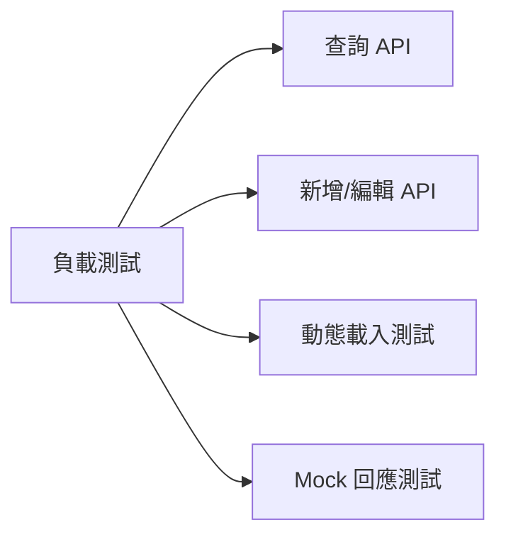

# 效能與容量需求

本章節定義系統效能指標與容量要求。

---

## NFR-PERF-001：API 回應時間

### 描述
API 請求的平均回應時間應小於 500ms（不含網路延遲）。

### 量測條件

| 項目 | 規格 |
|------|------|
| 測試環境 | 單機部署，CPU 4 核心，RAM 8GB |
| 測試負載 | 50 個並發請求 |
| 測試場景 | 查詢 Endpoint/Restful 清單、呼叫 Mock 回應 |

### 驗收標準

:::tip 效能指標
- **P90**：90% 的請求回應時間 < 500ms
- **P99**：99% 的請求回應時間 < 1000ms
:::

---

## NFR-PERF-002：動態載入延遲

### 描述
從 JAR 載入類別並發布服務的時間應小於 3 秒。

### 量測條件

| 項目 | 限制 |
|------|------|
| JAR 檔案大小 | < 10MB |
| 包含的類別數量 | < 50 個 |

### 驗收標準

✅ **成功情境**：
- 啟用 Endpoint/Restful 的操作在 3 秒內完成
- 前端介面顯示載入進度指示器

---

## NFR-PERF-003：並發請求支援

### 描述
系統應支援至少 50 個並發 API 請求。

### 量測條件

| 項目 | 規格 |
|------|------|
| 測試環境 | 單機部署 |
| 測試場景 | 多個 API 同時被呼叫 |

### 驗收標準

:::warning 並發限制
- 50 個並發請求時，錯誤率 < 1%
- 資料庫連線池不會耗盡
:::

---

## NFR-PERF-004：資料庫容量

### 描述
系統應支援至少以下資料量：
- 100 個 JAR 檔案
- 500 個 Endpoint/Restful
- 1000 個 Mock Response

### 驗收標準

✅ **容量要求**：
- 資料庫檔案大小 < 5GB
- 查詢效能不因資料量增加而顯著下降

---

## 效能測試建議

### 測試工具

| 工具 | 用途 |
|------|------|
| **JMeter** | API 負載測試 |
| **Gatling** | 並發壓力測試 |
| **VisualVM** | JVM 效能監控 |

### 測試場景

### 效能優化建議

:::tip 優化方向
1. **資料庫索引**：為常用查詢欄位建立索引
2. **連線池調整**：增加資料庫連線池大小
3. **快取機制**：快取 JAR 檔案內容與 Mock 回應
4. **非同步載入**：考慮將 JAR 載入改為非同步操作
:::
