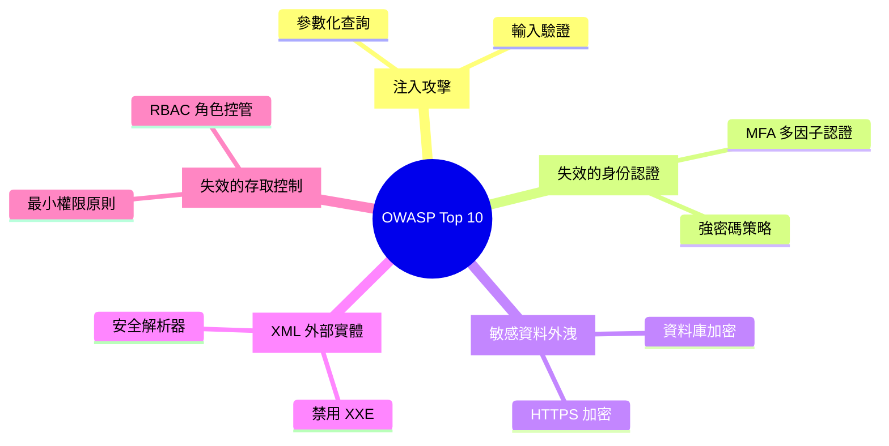

# 安全性與隱私需求

本章節定義系統安全性要求與資料保護策略。

---

## NFR-SEC-001：JAR 檔案安全性掃描

### 描述
系統應對上傳的 JAR 檔案進行基本安全檢查。

### 檢查項目

| 檢查項目 | 說明 |
|---------|------|
| 檔案格式驗證 | 檢查是否為有效的 ZIP 格式 |
| 檔案大小限制 | 最大 50MB |
| 病毒掃描 | <!-- TODO: 待評估整合 ClamAV --> |

### 驗收標準

❌ **失敗情境**：
- 無效的 JAR 檔案無法上傳
- 超過大小限制的檔案無法上傳

---

## NFR-SEC-002：API 認證與授權

### 描述
系統應提供 API 認證與授權機制（<!-- TODO: 具體方案待定 -->）。

### 候選方案

| 方案 | 優點 | 缺點 |
|------|------|------|
| **HTTP Basic Authentication** | 簡單易實作 | 需搭配 HTTPS |
| **JWT Token** | 無狀態，適合前後端分離 | 需實作 Token 刷新 |
| **API Key** | 適用於系統間整合 | 需實作 Key 管理 |

### 驗收標準

:::warning 認證要求
- 未認證的請求應返回 401 Unauthorized
- 無權限的操作應返回 403 Forbidden
:::

---

## NFR-SEC-003：輸入驗證

### 描述
所有使用者輸入應進行驗證，防止 SQL 注入與 XSS 攻擊。

### 驗證項目

| 欄位 | 驗證規則 |
|------|---------|
| Publish URI | 僅允許 `/` 與字母數字 |
| Class Path | 僅允許 `.` 與字母 |
| Response Content | XML/JSON 格式檢查 |

### 驗收標準

❌ **安全防護**：
- 惡意輸入被拒絕並記錄
- 錯誤訊息不洩漏系統內部資訊

---

## NFR-SEC-004：資料保護

### 描述
敏感資料應加密儲存（<!-- TODO: 目前無敏感資料，未來若新增需評估 -->）。

### 保護措施

| 資料類型 | 保護方式 |
|---------|---------|
| 資料庫連線密碼 | 不以明文儲存 |
| 日誌檔案 | 不包含敏感資訊 |
| JAR 檔案 | <!-- TODO: 可考慮 AES 加密 --> |

### 驗收標準

✅ **資料保護**：
- 資料庫連線密碼不以明文儲存
- 日誌不包含敏感資訊

---

## 安全性設計建議

### OWASP Top 10 防護



### 輸入驗證範例

```java
// Publish URI 驗證
@Pattern(regexp = "^/[a-zA-Z0-9/_-]+$",
         message = "Publish URI 格式錯誤")
private String publishUri;

// Class Path 驗證
@Pattern(regexp = "^[a-zA-Z0-9.]+$",
         message = "Class Path 格式錯誤")
private String classPath;
```

### 安全性檢查清單

:::tip 上線前檢查
- [ ] 所有 API 端點已實作認證
- [ ] 輸入驗證規則已完整實作
- [ ] HTTPS 已啟用（生產環境）
- [ ] 錯誤訊息已過濾敏感資訊
- [ ] 日誌已過濾敏感資料
- [ ] SQL 注入測試通過
- [ ] XSS 攻擊測試通過
:::
