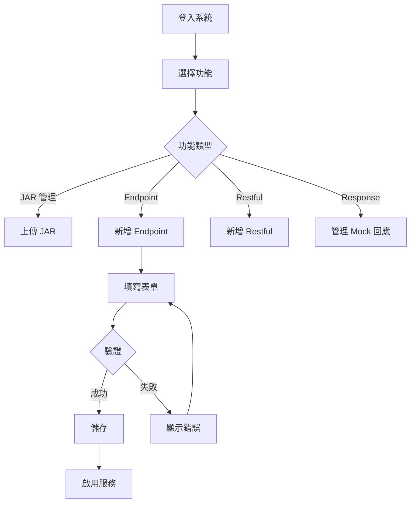

# 使用性與易用性需求

本章節定義系統的使用者體驗要求。

---

## NFR-USAB-001：前端介面易用性

### 描述
前端介面應簡潔易用,符合一般使用者習慣。

### 設計原則

| 原則 | 說明 |
|------|------|
| **一致性** | 使用 Material-UI 元件庫，保持視覺風格一致 |
| **簡潔性** | 操作流程不超過 3 步驟 |
| **即時回饋** | 提供載入動畫、成功/錯誤提示 |

### 驗收標準

:::tip 易用性目標
新使用者無需培訓即可完成基本操作（上傳 JAR、新增 Endpoint）
:::

✅ **使用者體驗**：
- 錯誤訊息清晰易懂，提供解決建議
- 操作提供確認對話框（如：刪除操作）
- 表單提供即時驗證與錯誤提示

---

## NFR-USAB-002：響應式設計

### 描述
前端介面應支援常見螢幕解析度（<!-- TODO: 是否需要支援行動裝置待評估 -->）。

### 支援解析度

| 裝置類型 | 解析度 | 支援狀態 |
|---------|--------|---------|
| **桌面** | 1920x1080 | ✅ 完整支援 |
| **桌面** | 1366x768 | ✅ 完整支援 |
| **平板** | 待評估 | <!-- TODO: 待評估 --> |
| **手機** | 待評估 | <!-- TODO: 待評估 --> |

### 驗收標準

✅ **響應式要求**：
- 在支援的解析度下，介面不會破版
- 表格與表單可正常操作

---

## NFR-USAB-003：瀏覽器相容性

### 描述
前端介面應支援主流瀏覽器。

### 支援瀏覽器

| 瀏覽器 | 版本 | 支援狀態 |
|--------|------|---------|
| **Chrome** | 最新版本 | ✅ 完整支援 |
| **Edge** | 最新版本 | ✅ 完整支援 |
| **Firefox** | 最新版本 | ✅ 完整支援 |
| **Safari** | 待評估 | <!-- TODO: 待評估 --> |

### 驗收標準

✅ **相容性要求**：
- 在支援的瀏覽器上，功能正常運作
- UI 顯示一致

---

## 使用者體驗設計

### 操作流程圖



### 錯誤訊息範例

:::warning 錯誤訊息設計原則
錯誤訊息應包含：
1. **問題描述**：告訴使用者發生什麼錯誤
2. **原因說明**：解釋為什麼會發生
3. **解決建議**：提供可行的解決方式
:::

**良好範例**：
```
❌ Publish URI 已存在

原因：Publish URI '/ws/company' 已被其他 Endpoint 使用

建議：
• 使用不同的 Publish URI（如：/ws/company-v2）
• 或刪除既有的 Endpoint 後再新增
```

**不良範例**：
```
❌ 錯誤：PUBLISH_URI_EXISTS
```

### 互動設計建議

:::tip UI/UX 建議
1. **載入狀態**：所有非同步操作顯示載入動畫
2. **成功提示**：操作成功後顯示綠色提示（自動消失）
3. **錯誤提示**：操作失敗後顯示紅色提示（需手動關閉）
4. **確認對話框**：刪除操作需二次確認
5. **快捷操作**：表格每行提供編輯/刪除/啟用快捷按鈕
:::
